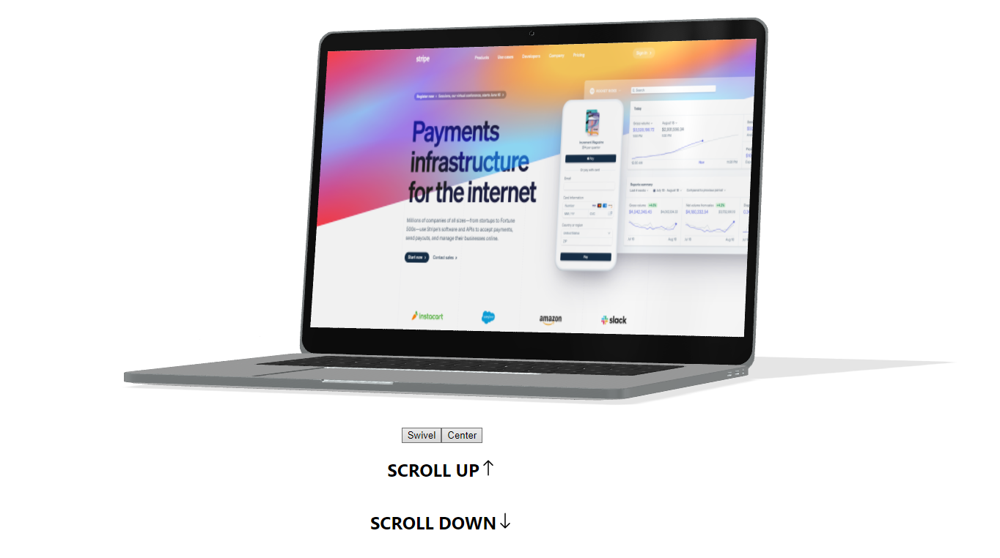

# Deviceful React Starter
   



## How to use

1. clone or fork this repo  
https://github.com/MiCurran/Deviceful-React.git  
```git clone https://github.com/MiCurran/Deviceful-React.git```  
2. cd into the boilerplate  
``` cd deviceful-react-boilerplate ```  
3. install dependencies  
```npm install```  
4. Add your screenshot (optional) to...  
```public/deviceful```  
5. test it out  
```npm start```  

